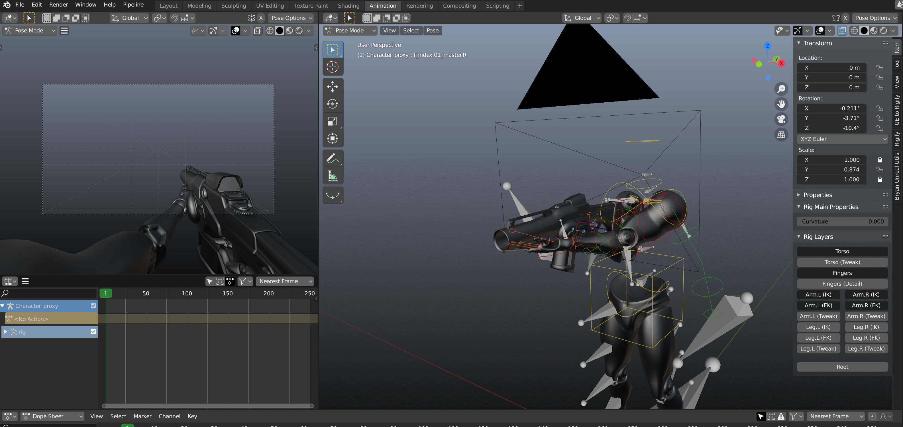

# Unreal FPS Animation Rig

My Blender files for creating First-Person shooter animations in Blender.
Sticking this on GitHub as a backup, so I can have some version history when I inevitably break it. 

I'm a gameplay programmer trying to teach myself a bit of FPS animation for fun, I have zero animation knowledge or ability. So obviously I make no claim that this is at all useful for anyone other than me, or in any way good :)

Animations are intended to be authored in the ShooterGame_FP_Animations.blend file.
The other two files contain the mesh for the character and weapon. I basically just imported the UE4 mannequin model, stripped it down to just the arms and legs, using a script I wrote (can be found in the addons folder), and used Epic's UE4 to Rigify addon to create a Rigify rig for it.

I only made this repository public because this is not my area of expertise, so I figured there's no harm that can come from sharing half finished work.

